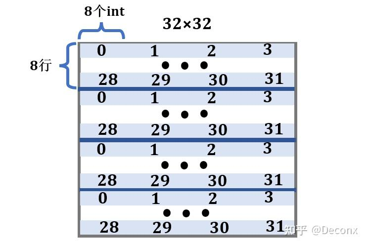

## 缓存行

根据测试代码显示(s=5,E=1,b=5)
所以每个缓存行的大小为2^5个字节,又因为数组是int型,即4字节,所以每个缓存行可以存8个数
因为缓存总大小为2^5*2^5字节,可以存32*8个数

## M 32 N 32

参考:[https://zhuanlan.zhihu.com/p/484657229](https://zhuanlan.zhihu.com/p/484657229)  
要存的数有32*32,所以缓存只能存1/4个数  


## function1

``` c
void transpose_submit(int M, int N, int A[N][M], int B[M][N])
{ 
    int temp1,temp2,temp3,temp4,temp5,temp6,temp7,temp8;
    for(int i;i<N;i++)
    for(int j=0;j<M;j=j+8)
    for(int k=i;k<i+8;k++)
    {
        temp1=A[k][j];
        temp2=A[k][j+1];
        temp3=A[k][j+2];
        temp4=A[k][j+3];
        temp5=A[k][j+4];
        temp6=A[k][j+5];
        temp7=A[k][j+6];
        temp8=A[k][j+7];
        B[j][k]=temp1;
        B[j+1][k]=temp2;
        B[j+2][k]=temp3;
        B[j+3][k]=temp4;
        B[j+4][k]=temp5;
        B[j+5][k]=temp6;
        B[j+6][k]=temp7;
        B[j+7][k]=temp8;
    

    }
}
```

## function2

``` c
void transpose_submit2(int M, int N, int A[N][M], int B[M][N])
{
    for(int i=0;i<N;i+=8)//
        for(int j=0;j<M;j+=8;)//
            for(int k=i;k<8;K++)
                for(int l=j;l<8;l++)
                {
                    B[k][l]=A[l][k];
                }
            
}


```
