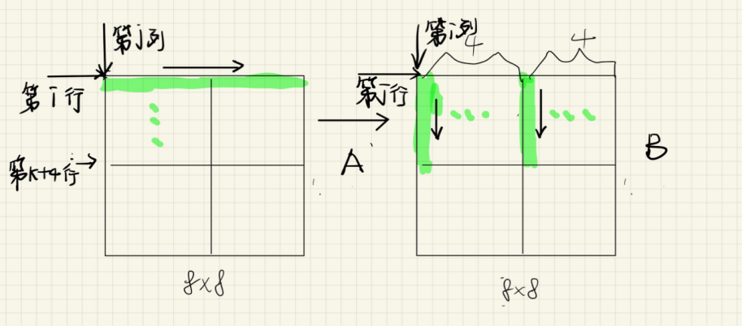
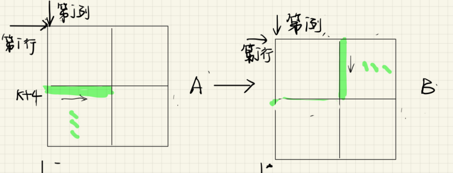
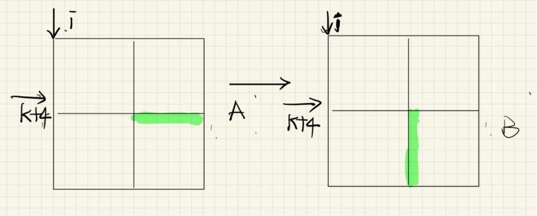

# 总过程

## 缓存行

根据测试代码显示(s=5,E=1,b=5)
所以每个缓存行的大小为2^5个字节,又因为数组是int型,即4字节,所以每个缓存行可以存8个数
因为缓存总大小为2^5*2^5字节,可以存32*8个数

## M 32 N 32

参考:[https://zhuanlan.zhihu.com/p/484657229](https://zhuanlan.zhihu.com/p/484657229)  
要存的数有32*32,所以缓存只能存1/4个数  


## function1

``` c
void transpose_submit(int M, int N, int A[N][M], int B[M][N])
{ 
    int temp1,temp2,temp3,temp4,temp5,temp6,temp7,temp8;
    for(int i;i<N;i++)
    for(int j=0;j<M;j=j+8)
    for(int k=i;k<i+8;k++)
    {
        temp1=A[k][j];
        temp2=A[k][j+1];
        temp3=A[k][j+2];
        temp4=A[k][j+3];
        temp5=A[k][j+4];
        temp6=A[k][j+5];
        temp7=A[k][j+6];
        temp8=A[k][j+7];
        B[j][k]=temp1;
        B[j+1][k]=temp2;
        B[j+2][k]=temp3;
        B[j+3][k]=temp4;
        B[j+4][k]=temp5;
        B[j+5][k]=temp6;
        B[j+6][k]=temp7;
        B[j+7][k]=temp8;
    

    }
}
```

## function2

``` c
void transpose_submit2(int M, int N, int A[N][M], int B[M][N])
{
    for(int i=0;i<N;i+=8)//
        for(int j=0;j<M;j+=8;)//
            for(int k=i;k<8;K++)
                for(int l=j;l<8;l++)
                {
                    B[k][l]=A[l][k];
                }
            
}


```

## M 64 N 64

利用8*8的块,再把块内部分成4个$4\times4$的小块  
主要步骤:  

- **第一步**:将A的左上和右上一次性转化并复制给B上面两小部分

- **第二步**:用本地变量把B的右上角存储下来
- **第三步**:将A的左下角复制给B的右上  

- **第四步**:利用上述存储B的右上角的本地变量,把A的右上复制给B的左下
- **第五步**:把A的右下复制给B的右下
  

``` c
void transpose_64(int M, int N, int A[N][M], int B[M][N])
{
 int temp1, temp2, temp3, temp4, temp5, temp6, temp7, temp8;
    for (int i = 0; i < M; i += 8) // A的行
    {
        for (int j = 0; j < N; j += 8) // A的列
        {
            // k用来遍历4*4小块的行,列不需要另设
            // 将A的上面两块倒置并复制到B的上面
            for (int k = i; k < i + 4; k++)
            {
                // 获取一行A
                temp1 = A[k][j + 0]; // miss其他都hit
                temp2 = A[k][j + 1];
                temp3 = A[k][j + 2];
                temp4 = A[k][j + 3];
                temp5 = A[k][j + 4];
                temp6 = A[k][j + 5];
                temp7 = A[k][j + 6];
                temp8 = A[k][j + 7];
                // 复制给B
                B[j + 0][k] = temp1; // 这部分位置已经正确,后续不需要修改
                B[j + 1][k] = temp2;
                B[j + 2][k] = temp3;
                B[j + 3][k] = temp4;
                B[j + 0][k + 4] = temp5; // 后续任然需要修改
                B[j + 1][k + 4] = temp6;
                B[j + 2][k + 4] = temp7;
                B[j + 3][k + 4] = temp8;
            }

            // 现在缓存中依然保存有B上面两小块
            // 用本地变量把B的两小块存储下来
            for (int k = j; k < j + 4; k++)
            {
                // 本地变量存储B的右上部分(最开始是A的左下部分),每次遍历行
                temp1 = B[k][i + 4];
                temp2 = B[k][i + 5];
                temp3 = B[k][i + 6];
                temp4 = B[k][i + 7];
                // 本地变量存储A的左下部分,每次遍历列,因为循环的变量是j
                temp5 = A[i + 4][k];
                temp6 = A[i + 5][k];
                temp7 = A[i + 6][k];
                temp8 = A[i + 7][k];
                // 利用存储的本地变量,把A的左下复制给B的右上,按行遍历
                B[k][i + 4] = temp5;
                B[k][i + 5] = temp6;
                B[k][i + 6] = temp7;
                B[k][i + 7] = temp8;
                // 利用存储的本地变量,把A的左下复制给B的右上,按行遍历
                B[k + 4][i + 0] = temp1;
                B[k + 4][i + 1] = temp2;
                B[k + 4][i + 2] = temp3;
                B[k + 4][i + 3] = temp4;
            }
            // 现在缓存中存的都是B
            // 将A的右下复制给B的右下
            for (int k = i + 4; k < i + 8; k++)
            {
                // 利用本地变量存储A的右下部分,每次遍历行
                temp1 = A[k][j + 4];
                temp2 = A[k][j + 5];
                temp3 = A[k][j + 6];
                temp4 = A[k][j + 7];

                B[j + 4][k] = temp1;
                B[j + 5][k] = temp2;
                B[j + 6][k] = temp3;
                B[j + 7][k] = temp4;
            }
        }
    }
}
```
