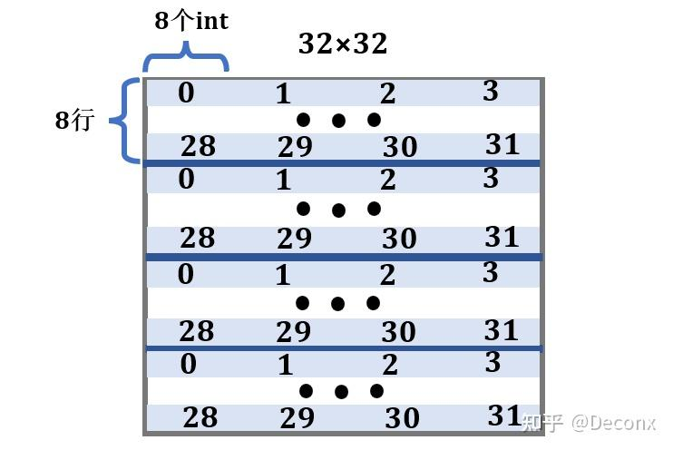

## 缓存行

根据测试代码显示(s=5,E=1,b=5)
所以每个缓存行的大小为2^5个字节,又因为数组是int型,即4字节,所以每个缓存行可以存8个数
因为缓存总大小为2^5*2^5字节,可以存32*8个数

## M 32 N 32
参考:[https://zhuanlan.zhihu.com/p/484657229](https://zhuanlan.zhihu.com/p/484657229)
要存的数有32*32,所以缓存只能存1/4个数  

